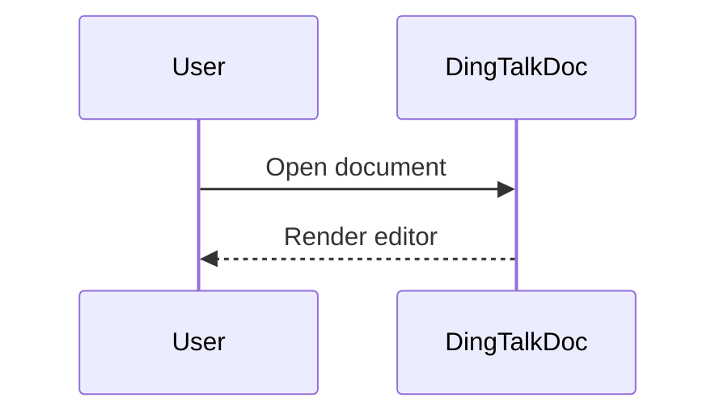

# 钉钉文档操作流程

面向 agent 的可执行流程。执行在线修改前，确认用户已经授权修改目标文档。

## 通用准备

所有正文读取和编辑优先进入文档 iframe：

```js
const frame = tab.playwright.frameLocator('#wiki-doc-iframe');
const text = await frame.locator('body').innerText({ timeoutMs: 5000 });
```

只把外层页面用于确认 URL、标题和 iframe 是否存在。正文文本、工具栏文本、光标定位和编辑动作都优先在 iframe 内完成。

需要 Playwright 操作细节、剪贴板粘贴、插入点定位、选区替换、保存状态判断或失败恢复时，读取 `browser-automation.md`。

修改前确认：

- 目标文档：当前打开文档或用户提供链接。
- 目标范围：当前光标、文档末尾、某段文字、某个标题、表格单元格、代码块或图形块。
- 目标动作：新增、追加、替换、格式化、插入原生块、修改原生块。
- 验证方式：iframe 文本、截图、自动保存状态。

## 读取文档

1. 确认 `iframe#wiki-doc-iframe` 存在。
2. 读取 `frame.locator('body').innerText()`。
3. 过滤工具栏和侧边噪声，例如 `分享`、`编辑`、`菜单`、`插入`、`添加图标`、`添加封面`、`设置文档信息`、`字数统计`。
4. 布局敏感内容用截图补充判断：标题层级、表格边界、代码块、流程图、封面、图标。

如果 iframe 不可读或正文为空，先判断是否被登录、权限、加载失败或 CAPTCHA 阻塞。

## 生成新内容或追加内容

1. 读取当前正文，判断是否已有内容。
2. 确认插入点。用户未指定时，默认当前光标或文档末尾，并先说明假设。
3. 先在 agent 侧生成可粘贴内容，不使用钉钉 `AI 创作`。
4. 长文优先生成 Markdown/纯文本：
   - `#`、`##`、`###` 用于标题层级。
   - `-` 和 `1.` 用于列表。
   - fenced code block 用于代码草稿。
   - 复杂表格、图形、日期、目录等在粘贴后用原生块补充。
5. 粘贴后读取文本并截图确认渲染。

追加到文档末尾：

1. 点击正文。
2. 支持时按 `ControlOrMeta+End`；不支持时滚动到底部并点击最后一个块之后。
3. 新建段落后粘贴内容。
4. 验证追加内容位于原内容之后。

在标题或段落前后插入：

1. 用 `ControlOrMeta+F` 搜索精确标题或段落片段。
2. 点击目标行，使用 `Home`、`End`、`ArrowUp`、`ArrowDown`、`Enter` 调整插入点。
3. 粘贴内容，确认前后顺序。

## 修改已有内容

采用最小改动：

1. 读取当前 iframe 文本。
2. 用精确文本、标题名或截图定位目标块。
3. 只选中目标内容，不选中整篇文档。
4. 粘贴替换内容。
5. 验证目标文本变化且周边内容未被破坏。

替换已知段落：

1. `ControlOrMeta+F` 搜索精确段落片段。
2. 点击找到的段落。
3. 用键盘或拖选选中该段落文本。
4. 粘贴替换文本。
5. 读取文本并截图确认。

批量修改：

- 先列出每个目标项和目标结果。
- 每次只处理一个目标项并验收。
- 出现定位不确定时停止，不要继续批量执行。

## 设置段落和章节标题格式

已验证 `正文` 样式菜单包含 `正文`、`标题1`、`标题2`、`标题3`、`标题4`、`标题5`、`标题6`。

1. 定位目标段落或标题。
2. 把光标放入目标段落，或选中整段文本。
3. 打开工具栏 `正文` 样式菜单。
4. 选择目标层级：
   - 普通段落：`正文`
   - 一级标题：`标题1`
   - 二级标题：`标题2`
   - 其他层级：`标题3` 到 `标题6`
5. 验证字号、加粗程度、目录层级或截图。

注意：

- `默认` 是字体菜单，不是标题层级菜单。
- “章节标题格式”优先理解为 `标题1` 到 `标题6` 的层级格式。
- 菜单点击后未展开时，不要猜坐标；请用户手动打开菜单或改用可验证的快捷路径。

## 插入和修改表格

优先路径：中文斜杠命令。

1. 把光标放到目标位置。
2. 输入 `/表格`。
3. 选择可见命令 `表格`。
4. 选择或确认行列数。
5. 验证表格出现在目标位置。

菜单路径：

1. 把光标放到目标位置。
2. 点击 `插入`。
3. 在 `基础 / 通用` 下选择 `表格`。
4. 如果菜单没有展开，停止自动点击，改用 `/表格` 或请用户打开菜单。

填充表格时准备 TSV：

```text
姓名	角色	状态
张三	后端	进行中
李四	前端	已完成
```

点击左上角目标单元格并粘贴 TSV。若整段落入一个单元格，用 `Tab` 逐格填写。

修改表格：

- 单元格替换：点击目标单元格，粘贴单个值或矩形 TSV。
- 新增行：移动到最后一个单元格，支持时按 `Tab` 创建新行，再粘贴 TSV。
- 替换整表：先截图或读取现表；用户未明确要求整表替换时先确认范围。

## 插入和修改流程图/时序图

优先使用可编辑原生块：

1. 把光标放到目标位置。
2. 流程图：输入 `/流程图`，或在 `插入` -> `画板图形` 中选择 `流程图`。
3. 文本驱动图或时序图：输入 `/文本绘图`，或在 `画板图形` 中选择 `文本绘图`。
4. 在图形编辑界面创建或粘贴内容。
5. 回到文档后截图验证图形块。

如果原生时序图不可用，插入 Mermaid 源码代码块作为 fallback，并向用户说明这不是原生渲染图形：



修改图形：

- 原生图形：通过周边标题或截图定位，点击或双击进入编辑器，只改目标节点、连线或标签。
- 文本绘图：只替换源码中用户要求改的部分，保留其他节点和顺序。
- 无法进入画布时：准备好源码或修改文本，让用户手动打开图形编辑器后继续。

## 插入和修改代码块

优先路径：

1. 把光标放到目标位置。
2. 输入 `/代码块`。
3. 选择可见命令 `代码块`。
4. 选择语言或保留默认语言。
5. 粘贴完整代码。
6. 验证缩进、换行和高亮。

菜单路径：

1. 点击 `插入`。
2. 在 `基础 / 通用` 下选择 `代码块`。
3. 如果菜单未展开，停止自动点击，改用 `/代码块`。

修改代码块：

- 小范围修改：点击代码块内部，定位目标片段，粘贴替换。
- 整块替换：只选中代码块内部代码，粘贴完整代码，验证仍是代码块。
- 内部选择不可靠时：先在旧代码块后插入新代码块并验证，再删除旧代码块。

## 其他原生组件

图片、文件、在线文档、同步块、模板内容、公式、日期、目录、高亮块、分栏、电子表格、任务、看板、投票、日程、视频会议、知识库、内嵌网页和应用组件见 `insert-components.md`。

使用原则：

- 已验证 `插入` 菜单中这些入口可见，但具体面板可能因租户权限不同而不同。
- 能用中文斜杠命令创建的组件优先使用完整命令名。
- 上传、提及、选择企业资源、创建会议/任务/投票、嵌入外部网页或连接三方应用前，确认用户授权了目标数据和影响范围。
- 只根据当前打开的面板可见文本继续，不猜测隐藏步骤。

## 验收清单

- iframe 文本包含新增或修改后的内容。
- 原有周边内容仍在正确位置。
- 标题层级、表格边界、代码块、图形、分栏、高亮块等通过截图确认。
- 自动保存状态可见、页面显示 `已保存` / `上次编辑`，或刷新后确认内容仍在。
- 没有触发 `AI 创作`、上传、分享权限或外部发送等未授权动作。
