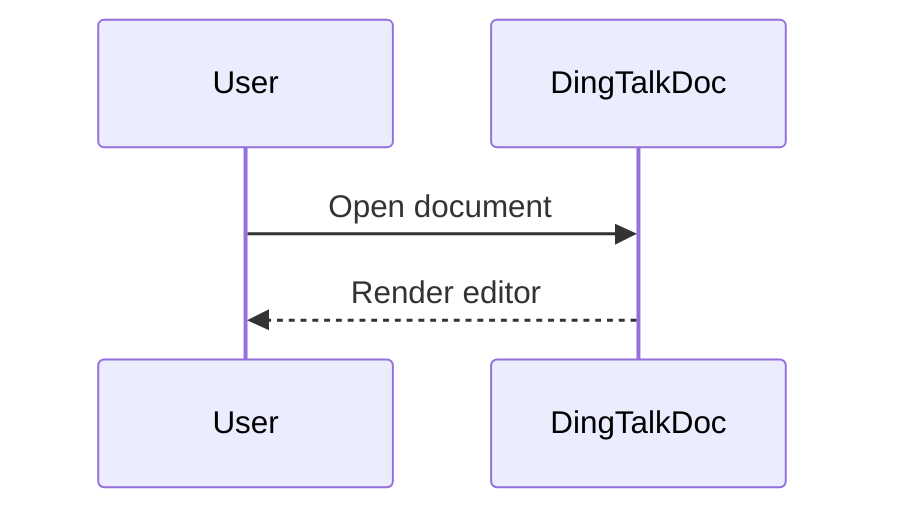

# 钉钉文档快速操作

这个参考文件用于在钉钉文档 Web 编辑器中快速、可重复地读取和修改内容。

## 通用准备

文档 iframe 存在时，所有正文读取和编辑动作都优先在 iframe 内完成：

```js
const frame = tab.playwright.frameLocator('#wiki-doc-iframe');
```

外层页面只用于定位 iframe 或文档壳。正文文本、工具栏文本和编辑动作都优先使用 `frame.locator('body')`。

修改在线文档前：

- 先确认目标位置：当前光标、文档末尾、某段精确文本前后、某个标题前后，或表格/代码块/图形块内部。
- 大段内容优先粘贴，不要逐字输入。
- 表格、图形、代码块优先使用钉钉原生插入命令。
- 修改后验证渲染结果和自动保存状态。

## 1. 快速读取钉钉文档内容

先读取 iframe 正文文本：

```js
const text = await frame.locator('body').innerText({ timeoutMs: 5000 });
```

如果返回内容混入工具栏或侧边栏噪声，保留正文内容，忽略 `分享`、`编辑`、`菜单`、`插入`、`添加图标`、`添加封面`、`设置文档信息`、`字数统计`、最近打开或导航项。

读取布局敏感内容时：

- 截取 iframe 或当前视口截图。
- 从截图确认标题层级、表格边界、图形预览和代码块框架。
- 用 DOM 文本确认内容，用截图确认布局。

页面已加载但正文为空时：

- 确认 `iframe#wiki-doc-iframe` 是否存在。
- 读取 `frame.locator('body')`，不要读取外层 `document.body`。
- 如果 iframe 内容不可用，让用户先完成登录、权限授权或 CAPTCHA。

## 2. 快速修改钉钉文档内容

采用最小改动：

1. 读取当前 iframe 文本。
2. 定位目标文本或标题。
3. 点击编辑器中的目标区域。
4. 用键盘导航或拖选只选中目标内容。
5. 粘贴替换文本。
6. 验证修改后的文本和可见布局。

替换已知段落：

- 使用浏览器查找快捷键 `ControlOrMeta+F` 搜索精确文本，把视口移动到目标位置。
- 点击找到的段落。
- 用快捷键或拖选选中该段落文本。
- 粘贴替换内容。

追加内容：

- 点击文档正文。
- 支持时按 `ControlOrMeta+End` 到文档末尾；不支持时滚动到末尾并点击最后一个块之后。
- 新建段落后粘贴内容。

在标题前后插入内容：

- 查找精确标题文本。
- 点击标题行开头或结尾。
- 用 `ArrowUp`、`ArrowDown`、`Home`、`End`、`Enter` 调整插入点。
- 粘贴新内容，并验证标题前后顺序。

## 3. 修改段落格式和章节标题格式

已在内置浏览器中验证：工具栏 `正文` 样式菜单包含 `正文`、`标题1`、`标题2`、`标题3`、`标题4`、`标题5`、`标题6`。

修改段落为正文或标题：

1. 通过精确文本、章节名或当前光标定位目标段落。
2. 点击目标段落内部，或选中需要调整格式的整段文本。
3. 打开工具栏 `正文` 样式菜单。
4. 选择目标格式：
   - 普通段落：选择 `正文`。
   - 一级章节标题：选择 `标题1`。
   - 二级章节标题：选择 `标题2`。
   - 继续按层级选择 `标题3` 到 `标题6`。
5. 验证可见字号、加粗程度、目录层级或周边文本顺序。

批量调整多个章节标题：

1. 先列出每个目标标题及其目标层级。
2. 逐个用 `ControlOrMeta+F` 搜索标题文本。
3. 每次只修改当前标题所在段落，避免选中正文内容。
4. 修改后读取 iframe 文本或截图，确认标题文本仍在原位置。

注意事项：

- 不要把 `默认` 菜单用于标题层级；当前验证中 `默认` 是字体菜单。
- 如果用户要求“章节标题格式”，优先理解为 `标题1` 到 `标题6` 的层级格式，而不是仅修改字体。
- 如果用户要求字体、字号或字体族，再读取 `verified-editor-capabilities.md` 中的字体说明。

## 4. 快速在指定位置插入表格

优先使用斜杠命令：

1. 把光标移动到目标位置。
2. 输入 `/表格`。
3. 选择可见命令 `表格`。
4. 选择或确认需要的行列数。
5. 验证表格出现在目标位置。

也可以使用工具栏：

1. 把光标移动到目标位置。
2. 点击 `插入`。
3. 在 `基础 / 通用` 下选择 `表格`。
4. 选择或确认需要的行列数。

如果表格需要初始数据，准备 TSV：

```text
姓名	角色	状态
张三	后端	进行中
李四	前端	已完成
```

表格创建后，点击左上角目标单元格并粘贴 TSV。验证行列是否正确对齐。

## 5. 修改表格内容

替换单元格内容：

1. 点击第一个目标单元格。
2. 粘贴单个值，或粘贴一个矩形区域的 TSV。
3. 如果批量粘贴没有正确拆分单元格，用 `Tab` 逐格移动并填写。
4. 逐项验证已修改单元格。

新增行或列：

- 点击表格内部，让表格控制项显示出来。
- 优先使用可见的行/列控制项或右键菜单。
- 如果自动化无法访问控制项，使用键盘路径：
  - 移动到最后一个单元格。
  - 支持时按 `Tab` 创建新行。
  - 粘贴新行 TSV。

替换整张表：

1. 读取或截图当前表格。
2. 如果用户没有明确要求替换整表，先确认替换范围。
3. 选中现有表格块。
4. 插入指定尺寸的新表格。
5. 粘贴 TSV 内容并验证对齐。

## 6. 快速在指定位置插入流程图/时序图

用户需要可编辑的可视化图形时，优先使用钉钉原生块：

1. 把光标移动到目标位置。
2. 流程图：输入 `/流程图`，或打开 `插入` 后在 `画板图形` 下选择 `流程图`。
3. 文本驱动图或时序图：优先输入 `/文本绘图`，或在 `画板图形` 下选择 `文本绘图`。
4. 在打开的图形编辑界面中创建内容。
5. 验证图形块出现在指定位置。

如果原生流程图界面无法创建时序图，先尝试 `文本绘图`。如果当前租户或版本没有 `文本绘图`，或它不支持所需语法，把 Mermaid 时序图源码作为代码块 fallback 插入，并明确告诉用户这是源码形式，不是原生渲染图形。

时序图源码示例：



## 7. 修改流程图/时序图内容

原生图形块：

1. 通过周边标题、文本或截图定位图形块。
2. 点击或双击图形块，打开图形编辑器。
3. 修改节点、连线、标签，或文本绘图源码。
4. 如果图形编辑器有明确的保存/完成按钮，执行保存/完成。
5. 回到文档中验证图形渲染结果。

文本绘图或源码型图形：

- 打开图形编辑器，只替换用户要求修改的源码或标签。
- 保留未受影响的节点、连线、参与者和顺序。
- 如果图形是代码块 fallback，按代码块修改流程处理。

自动化无法进入内部画布时：

- 准备好用户需要粘贴的源码、节点名或标签文本。
- 让用户手动打开图形编辑器后，继续在可编辑文本/源码区域中操作。

## 8. 快速在指定位置插入代码块

优先使用斜杠命令：

1. 把光标移动到目标位置。
2. 输入 `/代码块`。
3. 选择可见命令 `代码块`。
4. 如果钉钉显示语言选择器，选择目标语言。
5. 粘贴代码。
6. 验证缩进、换行和语法高亮。

也可以使用工具栏：

1. 把光标移动到目标位置。
2. 点击 `插入`。
3. 在 `基础 / 通用` 下选择 `代码块`。
4. 把代码粘贴到新代码块中。

为了保证粘贴可靠，先把代码写入浏览器剪贴板，再粘贴到聚焦的代码块。不要逐字符输入大段代码。

## 9. 修改代码块内容

小范围修改：

1. 通过周边文本、语言标签或可见代码片段定位代码块。
2. 点击代码块内部。
3. 使用查找或键盘导航选中精确目标文本。
4. 粘贴替换内容。
5. 验证缩进和换行。

替换整个代码块：

1. 点击代码块内部。
2. 只选中代码块内部代码，不要选中整篇文档。
3. 粘贴完整替换代码。
4. 验证它仍然是代码块，没有变成普通段落。

如果代码块内部选择不可靠：

- 在旧代码块后立即插入一个新代码块。
- 粘贴修正后的代码。
- 只有在新代码块渲染正确后，才删除旧代码块。
